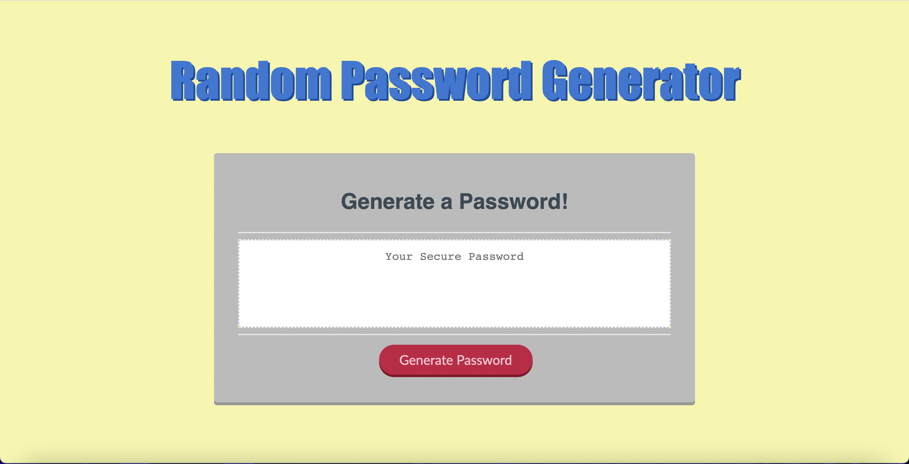
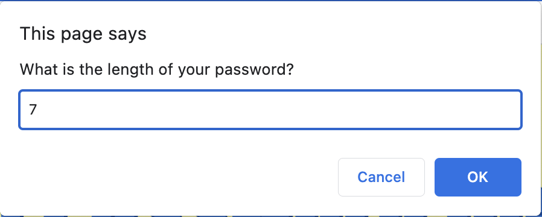
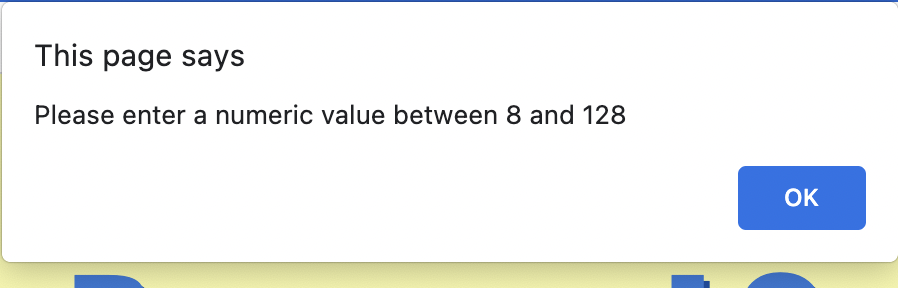
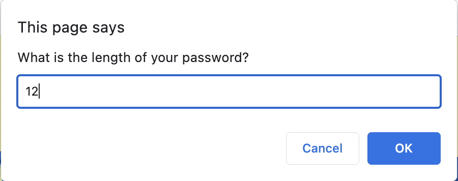
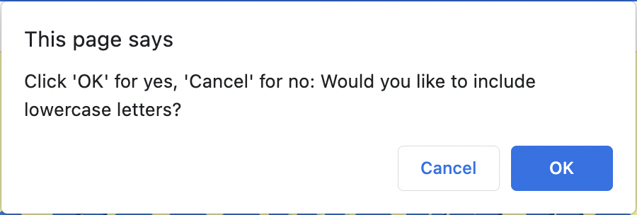
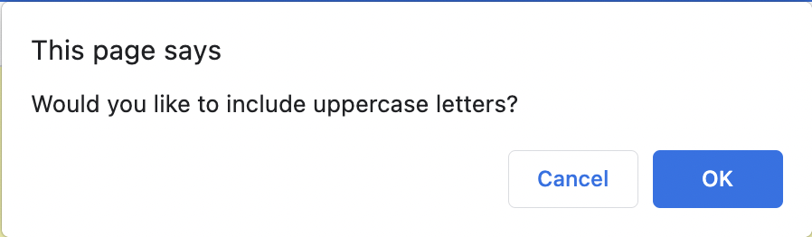
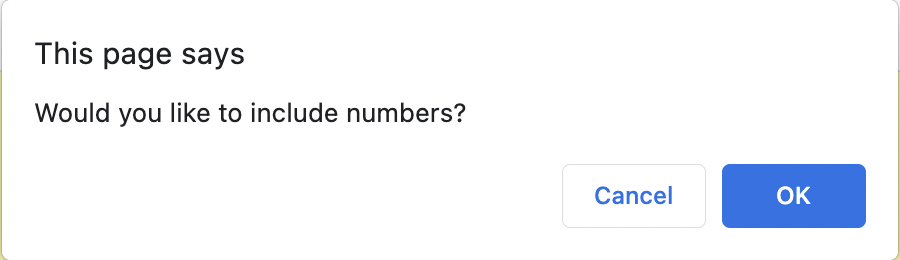
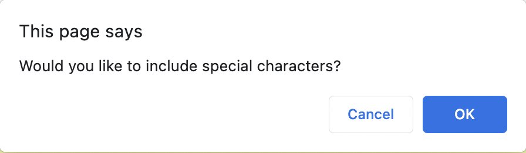
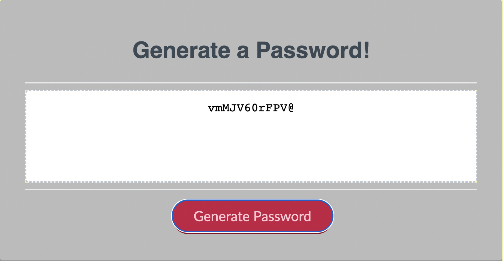

# animated-bassoon-3
Module Challenge 3 presents the task of creating a random password generator using HTML, CSS, and now JavaScript

# Description

For this week's challenge I have applied all my basic knowledge and understanding of JavaScript to create a functional random name generator.

This was an especially challenging project, as logic is apparently not my strong suit. I worked for a few hours adding to, removing from, rearranging and revising my code, generating different (and undesired) results as I worked with each moving part. Some things nearly worked, and other things did not do anything to help at all, and through this process I was able to figure out what went wrong and how to fix it. 

Ultimately I came to a stand-still with the random generation. Since I couldn't find any existing code that we had worked with in class to randomly generate characters, I finally resorted to searching for the answers online. I found the string of code I was looking for and worked it into my code until it finally generated the results I wanted. 

This project helped me practice declaring variables, calling functions, creating a working for-loop. I have ingrained the difference between a string and a number into my brain (this somehow tripped me up the most, and I kept overthinking it). This project also gave me an opportunity to mess with the CSS styling a bit further and create somethign more aesthetically pleasing. I know it wasn't in the acceptance criteria, but as a graphic designer I can't help myself. 

# Usage

Open the webpage using this link: https://hipster-rufus.github.io/animated-bassoon-3. The url should take you to a page that looks like this:

When you click on the "Generate Password" button below, the first prompt should pop up asking you what you want the length of your password to be.

However, if you were to enter the same number as in the example or less than that number, this alert will pop up:

When your input meets the code's criteria, it will lead you through a series of questions to gather information:

And finally, when you've answered all of the prompts, your password is generated below in the box:

# Credits

This link is where I found the string of code that I needed to complete the project:
https://stackoverflow.com/questions/1349404/generate-random-string-characters-in-javascript
You can find the referenced line of code at line 33 of my script.js file. 